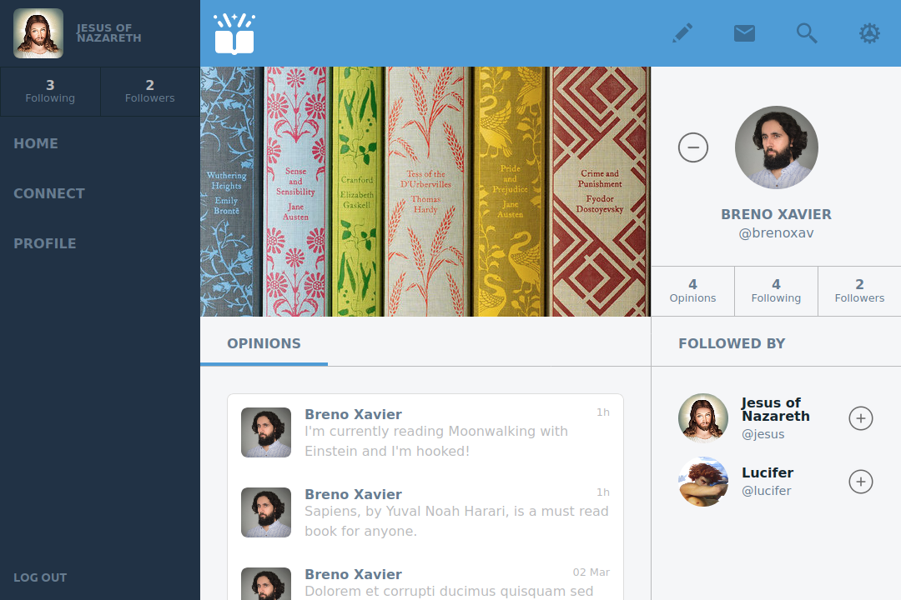
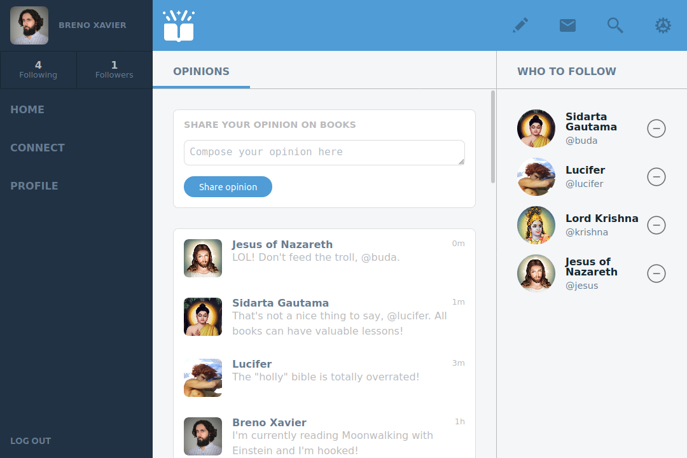

# Goodbooks: Social network for book lovers

> "Goodbooks" is a twitter-like web app for book lovers to share their opinions on their reads.




This is my capstone project for the Ruby on Rails path of the Microverse program.
It is my attempt at implementing an MVP version of "Goodbooks": a twitter-like app with working features, such as:
- Simple login function (sessions)
- Side panel with user's info, stats and navigation links
- Form to post "opinions"
- Homepage listing user's latest "opinions"
- Side panel showing suggestions for "who to follow" (homepage)
- Userpage with their latest posted "opinions"
- Side panel showing user's profile, stats, and followers (user page)
- Button to "follow" users

## Built With

- Ruby 3.0.0
- Ruby on Rails 6.1.3
- PostgreSQL 12.6

<!-- ## Live Demo -->

<!-- [Take a look at a live demo of this app](https://####.herokuapp.com/) -->

## Getting Started

To get a local copy up and running follow these steps:

### Prerequisites

- Ruby: >=3.0.0
- Rails: >=6.1.3
- Postgres: >=12.6

### Setup

- Clone or download the project to your local machine

- Change to the project's root directory
```
cd goodreads
```

- Install the required gems
```
bundle install
```

- Setup the database
```
rails db:create
rails db:migrate
```

- Start the server
```
rails server
```

- Access the application's web interface on your browser
```
http://localhost:3000/
```
### Testing

- To execute the included unit and integration tests
```
rspec
```

## Author

👨‍💻 **Breno Xavier**

- GitHub: [@brenoxav](https://github.com/brenoxav)
- Twitter: [@brenoxav](https://twitter.com/brenoxav)
- LinkedIn: [Breno Xavier](https://linkedin.com/in/brenoxav)

## Show your support

Give a ⭐️ if you like this project!

## Acknowledgments

- [Gregoire Vella](https://www.behance.net/gregoirevella), for the concept design
- Microverse
- Odin Project